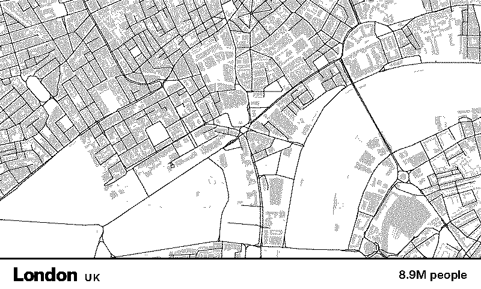

# Streetlines

A TRMNL plugin that fills the screen with a **big city's street network** — just
the roads, drawn as clean black lines on white — with the city, country and
population along the bottom. On every refresh it shows a **random** city.



## How it works

- **`src/transform.py`** is a self-contained serverless transform. It holds
  pre-baked street geometry for its cities and, on each refresh, returns a random
  city's roads as SVG polylines plus its name / country / population. London also
  includes building footprints, drawn behind the streets in light grey.
- **No API key and no network call at render time**, so it renders instantly and
  comfortably fits the serverless budget (128 MB / 5 s).
- **`src/full.liquid`** draws those polylines into an `800×430` SVG that fills the
  screen edge-to-edge (cover-fit to the dense city core), with a bottom bar for
  the labels. It also neutralises the framework's bleed padding so the bar stays
  on-panel across TRMNL resolutions. `half_*` and `quadrant` render a
  cropped-to-fill version.
- `polling_url` (dummyjson) is only a keepalive — the transform generates all
  render data itself, so the polled response is ignored.

The geometry was baked from **OpenStreetMap** via the Overpass API: each city's
roads (motorway → residential) inside a ~3 km box around the centre, projected to
pixels and simplified (Douglas–Peucker) to stay small.

Cities: Barcelona, New York, London, Berlin, Paris, Tokyo.

## Develop

```bash
cd streetlines
trmnlp serve      # http://localhost:4567  (live preview)
```

On the device, pressing the reset button forces a refresh (a new random city).

---

Map data © OpenStreetMap contributors, licensed under the ODbL.
Plugin by Tomic Riedel for the Spark × TRMNL Hackathon.
